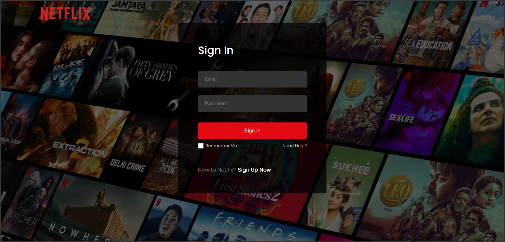

# 🎬 Netflix Clone

Netflix Clone is a movie streaming web application built with React. Users can browse movies, explore different categories, watch trailers, and authenticate using Firebase.

---

## 🚀 Live Demo

🔗 **Live Website:** 

---

## 📸 Preview

```md
[](https://quick-chat-app-eight.vercel.app/)
```

---

## ✨ Features

* 🎬 Browse Movies
* 🔥 Popular Movies
* ⭐ Top Rated Movies
* 🎥 Upcoming Movies
* ▶️ Watch Movie Trailers
* 🔐 Firebase Authentication
* 👤 User Login & Signup
* 📱 Responsive Design
* 🔎 Movie Information
* 🎞️ YouTube Trailer Player
* 🧭 React Router Navigation

---

## 🛠️ Tech Stack

### Frontend

* React
* Vite
* CSS
* React Router
* Firebase
* React Firebase Hooks

### APIs

* TMDB API
* YouTube

---

## 🔐 Authentication

Firebase Authentication is used to handle user authentication.

Users can securely:

* Create an account
* Log in
* Log out
* Access authenticated features

---

## 🎥 Movie Trailers

Movie information and video data are retrieved from the TMDB API.

YouTube is used to play movie trailers inside the application's custom player page.

---

## 🗄️ Movie Data

The application uses the **TMDB API** to retrieve movie information.

Movie data includes:

* Movie Title
* Poster
* Backdrop
* Overview
* Release Date
* Rating
* Movie Trailers
* Movie Categories

---

## ⚙️ Environment Variables

Create a `.env` file in the project root.

```env
VITE_FIREBASE_API_KEY=""
VITE_FIREBASE_AUTH_DOMAIN=""
VITE_FIREBASE_PROJECT_ID=""
VITE_FIREBASE_STORAGE_BUCKET=""
VITE_FIREBASE_MESSAGING_SENDER_ID=""
VITE_FIREBASE_APP_ID=""
VITE_TMDB_API_KEY=""
```

> ⚠️ Never upload your `.env` file or sensitive API credentials to GitHub.

---

## 🚀 Installation

### 1. Clone the Repository

```bash
git clone https://github.com/Preethigajeganathan/Netflix-Clone.git
cd Netflix-Clone
```

### 2. Install Dependencies

```bash
npm install
```

### 3. Configure Environment Variables

Create a `.env` file and add your Firebase and TMDB configuration.

### 4. Start the Development Server

```bash
npm run dev
```

Vite will provide the local development URL in the terminal.

---

## 📁 Project Structure

```text
Netflix-Clone/
│
├── public/
│
├── src/
│   ├── assets/
│   ├── components/
│   ├── pages/
│   ├── App.jsx
│   └── main.jsx
│
├── .env
├── .gitignore
├── package.json
├── vite.config.js
└── README.md
```

---

## 🔄 Application Flow

1. User opens the Netflix Clone application.
2. Movies are retrieved from the TMDB API.
3. Movies are displayed in different categories.
4. Users can browse popular, upcoming, and top-rated movies.
5. Users can select a movie or trailer.
6. The application navigates to the Player page.
7. The selected trailer is played using YouTube.
8. Firebase handles user authentication.

---

## 🎬 Movie Categories

The application displays movies from different TMDB categories:

* Popular
* Top Rated
* Upcoming
* Now Playing

---

## 🔒 Security

The project uses:

* Firebase Authentication
* Environment variables
* `.gitignore` to prevent `.env` from being committed

Sensitive credentials should never be committed to the repository.

---

## 🛠️ Useful Commands

### Install Dependencies

```bash
npm install
```

### Start Development Server

```bash
npm run dev
```

### Build for Production

```bash
npm run build
```

### Preview Production Build

```bash
npm run preview
```

---

## 📦 Main Dependencies

* react
* react-dom
* react-router-dom
* firebase
* react-firebase-hooks

---

## 👨‍💻 Author

**Preethiga**

Built with ❤️ using React, Firebase, TMDB API, and YouTube.

---

## 📄 License

This project is created for learning and personal use.
